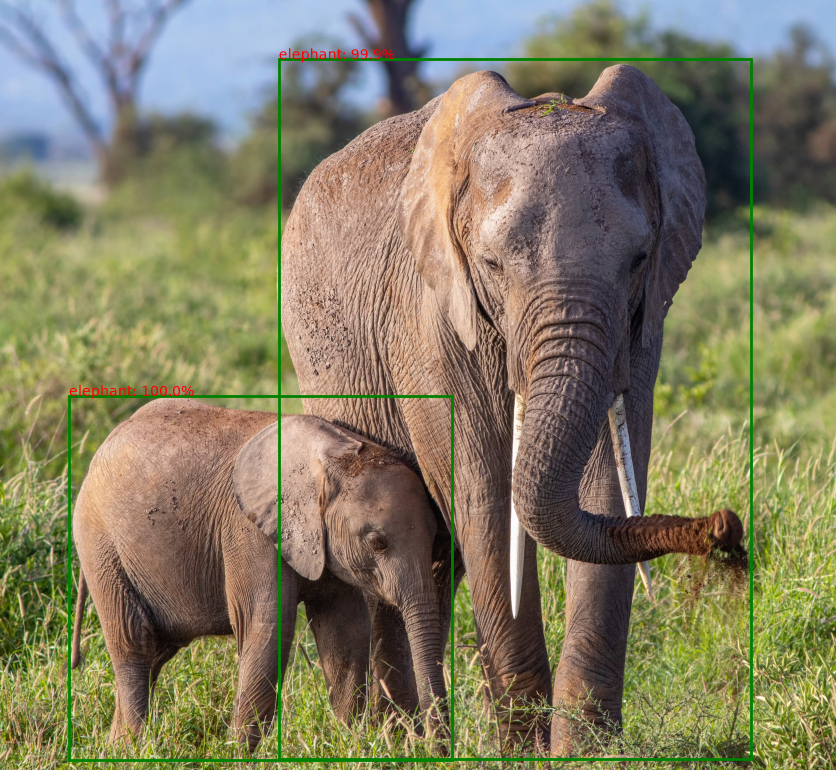
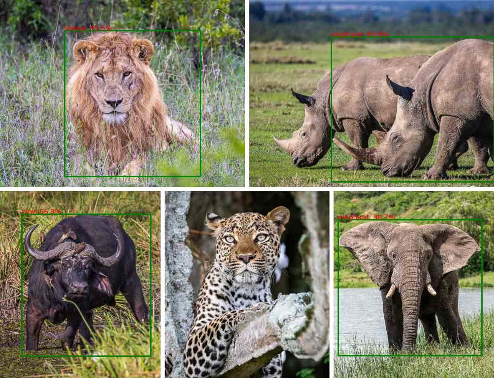
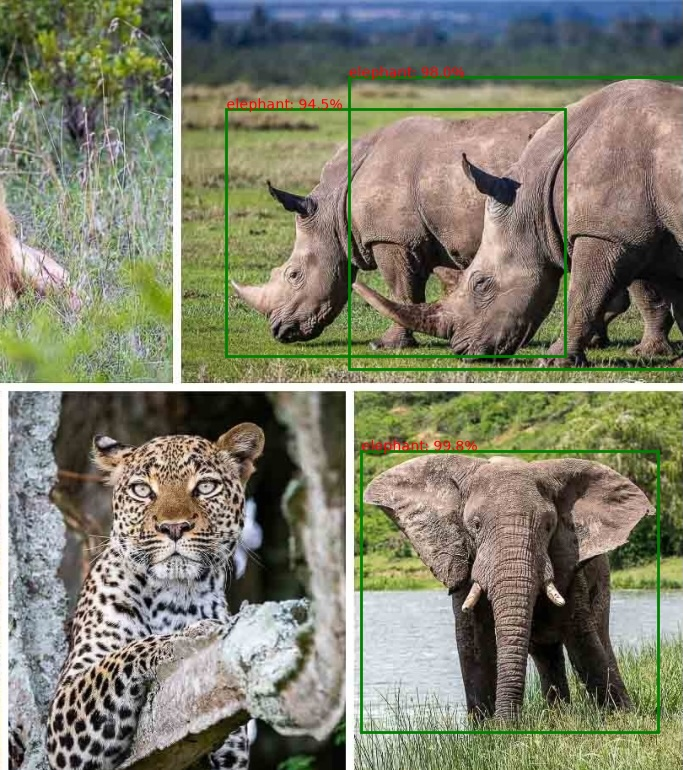

# Practice_Object_ID
This project applies the Hugging Face pipeline pattern (device selection, pipeline creation, Gradio input/output setup) to both the object-detection and text-to-speech tasks.

## Attribution
This app is based on the following course reference repository: https://github.com/altafumer/Object_detection_using_HF ("Object Identification and text to speech model using HuggingFace Transformers")

## Models used
| Component | Model | Task |
|---|---|---|
| Object detection | `facebook/detr-resnet-50` | `object-detection` |
| Text-to-speech | `facebook/mms-tts-eng` | `text-to-speech` |

## Object detection pipeline applying modified codes
> def build_object_detector(model_name: str = OBJECT_DETECTION_MODEL): return pipeline("object-detection", model_name)
> 
> def detect_objects(od_pipe, raw_image: Image.Image):return od_pipe(raw_image)

> def run_detection_demo(od_pipe, image_path: str = SAMPLE_IMAGE_PATH): raw_image = Image.open(image_path)
>    raw_image.resize((500, 400))  # standardized preview size
>    pipeline_output = detect_objects(od_pipe, raw_image)
>    processed_image = render_results_in_image(raw_image, pipeline_output)
>    return raw_image, pipeline_output, processed_image

## Audio narration
> def build_tts_pipeline(model_name: str = TTS_MODEL_VITS):
>    if model_name == TTS_MODEL_BARK:
>        return pipeline("text-to-audio", model=model_name)
>    return pipeline("text-to-speech", model=model_name)

## Result

Identified two elephants. 

